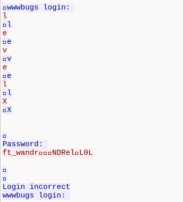
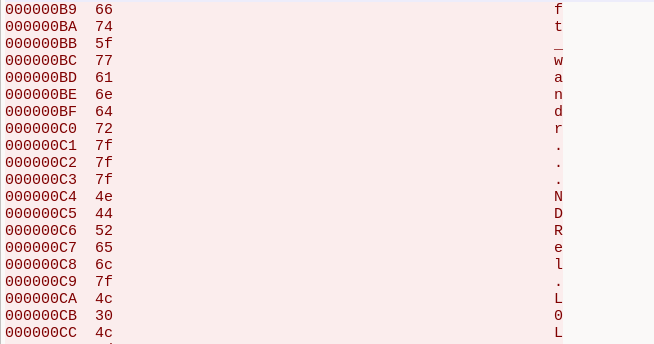

# Level02

## Démarche


1. *Reconnaissance** : un fichier `level02.pcap` est présent dans le
   home de `level02`.
    c'est un ficier aui a capture un trafic réseau au format pour wireshark

2. *Récupération sur la machine hôte** via `scp` pour l'analyser
   confortablement :
   ```bash
   scp -P 4242 level02@<IP>:/home/user/level02/level02.pcap .
   ```

3.**Analyse avec Wireshark / tshark** : la capture ne contient qu'**une
   seule connexion TCP**

Reconstitution du flux via *Follow → TCP Stream*.




4.**Faille** : les identifiants **en clair** sur le
   réseau. La capture contenait donc directement le mot de passe tapé
   par un utilisateur 

5.**Décodage** : la vue ASCII simple affichait des caractères illisibles
   (points `.`). Passage en **vue hexadécimale**, pour identifier ces octets. Ils correspondaient au code`7f` = **DEL/Backspace**

   

   Séquence brute reçue :
   ```
   f t _ w a n d r [DEL][DEL][DEL] N D R e l [DEL] L 0 L
   ```

   ```
   Mot de passe réel tapé : **`ft_waNDReL0L`**
